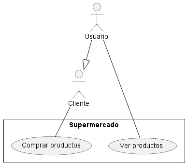
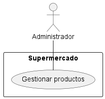
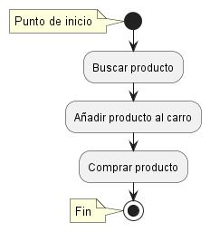
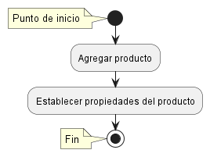
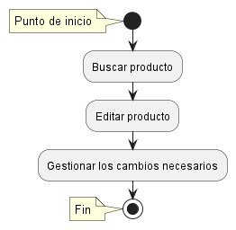
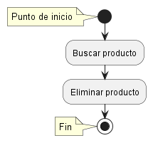

# Análisis

Nombre del proyecto: SuperTierno

Integrantes: Pablo Delgado Soto, Zijun Hu, Israel Castejón Pastor, Marcos Rodrigo González.

Versión: 1.0

# Índice

[Descripción del problema a resolver](#descripción-del-problema-a-resolver)  
[Estudio de mercado](#estudio-del-mercado-de-otras-soluciones)  
[Requisitos](#requisitos)  
[Casos de uso](#casos-de-uso)  
[Diagrama de actividad](#diagrama-de-actividad-de-los-casos-de-complejos)

### Descripción del problema a resolver

Se necesita una aplicación para gestionar compras en línea de un supermercado.

### Estudio del mercado de otras soluciones
(tanto en funcionamiento como productos comerciales para implantar la solución). De las otras soluciones nos interesa:

1. Nombre
   - Dia
   - Carrefour
   - Lidl
   - Mercadona
   - Aldi
   - Ahorra más
  
2. Descripción breve
   - Muestran productos a la venta al usuario, permiten añadirlos a su cesta para más tarde comprar todos los productos escogidos a la vez.
  
3. Cómo encontrarlas (url)
   - A partir del nombre del supermercado.
  
4. Qué podemos aprovechar de este conocimiento.

   - Fácil de entender para todo el mundo 
   - Nombre sencillo y fácil de recordar.
   - Buscar diferencación sin dejar de hacer algo que ya hacen.
   - Todos cumplen una misma función, diseñar una aplicación que pueda modificar el estilo y nombre del supermercado permitirá potencialmente venderla a diferentes supermercados sin costes muy altos.
   
### Requisitos

1. Funcionales: Funcionalidad completa del sistema
   
   - Comprar productos
   - Gestionar productos
  
2. No funcionales: Restricciones del funcionamiento

   - Disponibilidad 24 horas
   - Compatible con diferentes sistemas operativos, navegadores y dispositivos
   - Cumplir con las regulaciones y normativas locales en cuanto a comercio electrónico y protección de datos

### Casos de uso

1. Relación entre roles de usuario y los casos de uso (basados en los requisitos funcionales)

### Diagrama de actividad de los casos de complejos.

  
  
  

