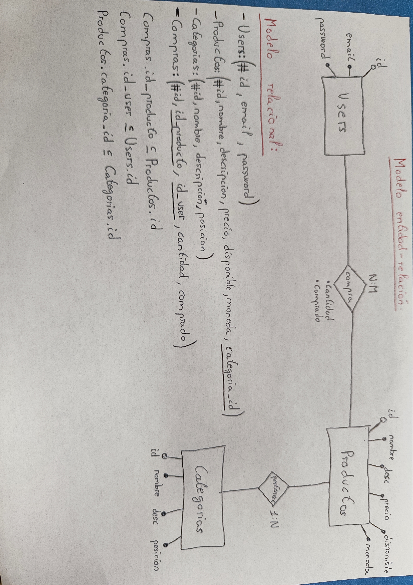
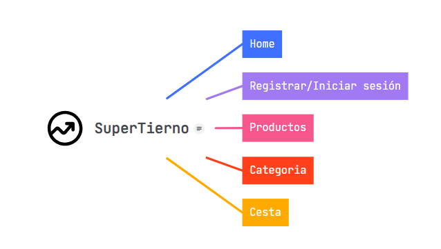
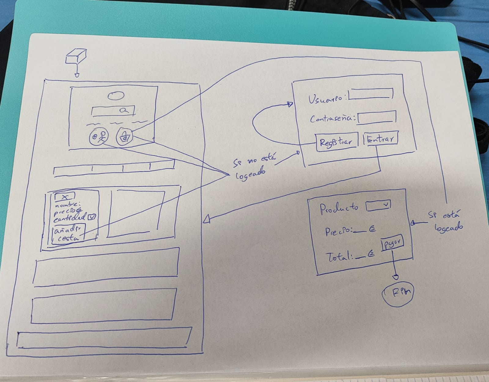

# Diseño

Versión 1.0

## Índice

[Justificación de la solución](#justificación-de-la-solución)  
[Diseño Arquitectónico](#diseño-arquitectónico)  
[Diseño UX/UI](#diseño-uxui)  
[Entorno de desarrollo](#entorno-de-desarrollo)  

### Justificación de la solución

Laravel ofrece una gran flexibilidad y control sobre la estructura y diseño de la aplicación. 
Puedes personalizar cada aspecto según las necesidades del supermercado online. Aunque WordPress 
es muy personalizable, a veces la complejidad de ciertas aplicaciones puede requerir más flexibilidad y control 
que lo que un CMS puede ofrecer. Laravel es conocido por su arquitectura escalable 
y su capacidad para manejar aplicaciones que evolucionan rápidamente como un supermercado ya que experimenta cambios en el número 
de productos, usuarios y transacciones así como futuras actualizaciones. Aunque WordPress 
puede manejar sitios web de comercio electrónico, Laravel ofrece mas capacidad de escalabilidad 
ya utiliza un patrón de diseño MVC. Laravel incluye Eloquent ORM, que facilita la gestión de la base de datos. 
Para un supermercado online, donde la gestión eficiente de inventario y transacciones 
es crucial, tener control total sobre la base de datos y la manipulación detallada de éstos, Laravel proporciona un control granular. 

### Diseño Arquitectónico

1. Arquitectura del proyecto
   - PHP: El lenguaje de programación principal para el backend.
   - Laravel Framework: Utilizado para la lógica del servidor y la gestión de rutas, controladores y modelos.
     - Blade: Motor de plantillas para las vistas.
   - MariaDB: Una base de datos relacional compatible con MySQL. Puede ser gestionada con herramientas como phpMyAdmin. Puedes utilizar migrations y seeders de Laravel para gestionar esquemas de base de datos y datos de prueba.
   - Git: Para el control de versiones del código fuente.
   - Composer: Para gestionar las dependencias de PHP, especialmente las dependencias de Laravel.
   - Artisan: La interfaz de línea de comandos de Laravel para realizar tareas comunes de desarrollo.
   - PHPUnit: Para realizar pruebas unitarias.

2. Diseño de los datos
    - Base de datos
      - Modelo entidad-relación
      - Modelo relacional
       
    - Otros repositorios de información
3. Diseño de componentes
    - Tightenco/ziggy: Usamos este componente para utilizar rutas en javascript ya que utilizamos ajax.
    - Laravel/breeze: Utilizamos este componente para la autenticación de usuarios.
    - Spatie/laravel permission: Utilizamos este componente para la gestión de roles y permisos.
   
### Diseño UX/UI

1. Sitemap   
   
2. Herramientas de navegación
    - Firefox
3. Prototipo
   
4. Diagramas de composición de vistas
   - Home
    
   - Productos
    
   - Categoría
    
   - Cesta
    
   - Inicio de sesión
    
   - Añadir categoría
    
   - Añadir producto
    
   - Detalle de producto
    
   - Detalle de producto(admin)
    
   - Modificar producto
    
### Entorno de desarrollo

1. Herramientas
    - Control de versiones
        - Git flow versión 1.12.3 (AVH Edition)
        - Github
    - Documentación
      - Markdown
    - Diagramado
      - PlantUML
    - Prototipado
      - Técnicas agile
2. Definición del entorno / Automatización
    - Docker
    - Utilización de una máquina virtual Debian
    - Utilización de dos contenedores en Docker
      - El framework Laravel
      - La base de datos en MariaDB con la versión 8.0.21
    - Utilización de Visual Studio Code versión 1.84.1
